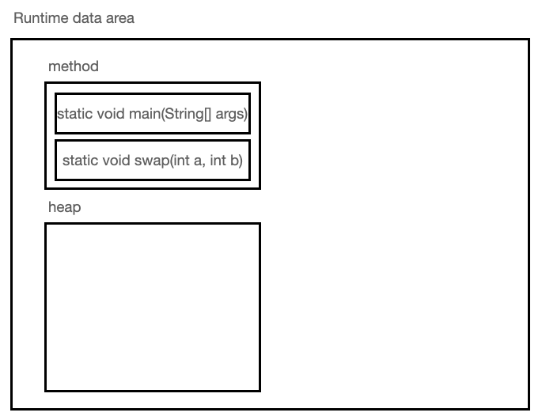
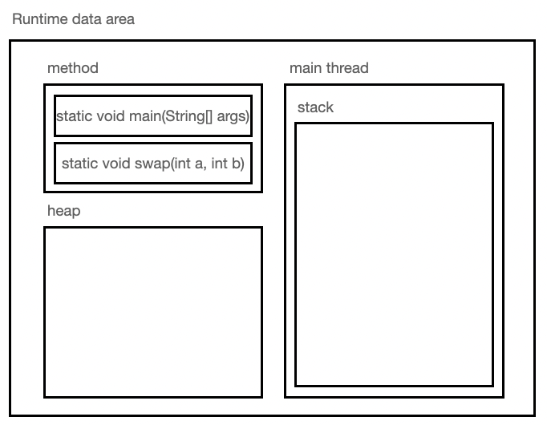
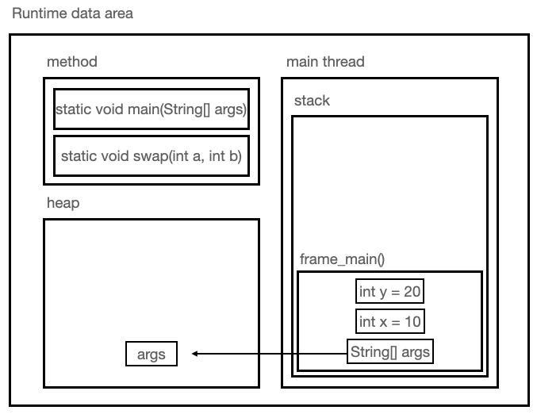
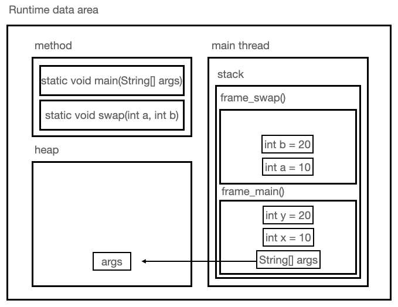
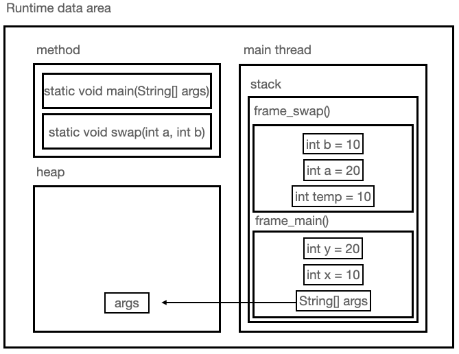

# Memory Structure Of Java

Java 의 메모리 구조에 대해 알아보자.

```java
public class Reference {
    public static void main(String[] args){
       int x = 10;
       int y = 20;

       swap(x,y);

       System.out.println("결과 : " + x + ", " + y);
    }

    static void swap(int a, int  b){
        int temp = a;
        a = b;
        b = temp;
    }
}
```

Java 를 조금이라도 써본 사람들은 위 코드의 출력 결과를 쉽게 맞출 수 있을 것이다.

```
결과 : 10, 20
```

하지만 어떤 원리에 의해 위와 같은 결과가 나오는 것인지 모른다면

Java 에 대한 이해가 부족하다는 의미이다.

## Java 코드의 동작과 JVM 메모리 구조

Java 소스 코드의 실행과정과 JVM 메모리 구조를 통해

위의 코드에 대해 자세히 알아보자.

1. Java Source Code(`.java`) 은 Java Compiler 에 의해 Byte Code(`.class`) 로 변환된다.

2. JVM 은 Byte Code(`.class`) 를 Class Loader 에 로드해 Runtime Data Area 에 적재한다.

3. 이 때, JVM 은 영역을 구분해 자료들을 분리한다.

    3-1. method 영역과 heap 영역을 생성하고, method 영역에 2개의 method 를 올려둔다.
    

    3-2. main thread 를 생성하고, 내부에 stack 영역을 생성한다.
    

    3-3. main method 내에서 선언된 변수들을 stack 영역에 생성한다.
    

    여기서 중요한 점은 아래와 같다.

    - `Primitive Type` 의 실제 값은 `stack 영역`에 생성

    - `Reference Type` 의 값을 가리키는 주소 값은 `stack 영역`, 실제 값은 `heap 영역`에 생성

    3-4. 3번과 같은 방법으로 swap method 내에서 선언된 변수들을 stack 영역에 생성한다.
    

    3-5. swap method 로직을 수행한다.
    

    3-6. swap method 가 종료되면 swap method 내의 변수들을 stack 영역에서 pop 한다.
    

    3-7. main method 의 로직을 수행하고 종료되면, main method 내의 변수들을 stack 영역에서 pop 한다.
    

## Thread 와 Stack, Heap

Thread 란 무엇일까?

구체적인 내용은 나중에 알아보도록 하고

`하나의 프로세스( = 실행중인 프로그램) 내에서 실제로 작업을 수행하는 주체`

정도로 이해하고 넘어가자.

2개 이상의 스레드를 갖는 프로세스를 멀티스레드 프로세스(multi-threaded process) 라고 한다.

기본적으로 운영체제에서 Thread 는 아래와 같은 특징을 가진다.

-   각 Thread 는 Stack 영역을 독립적으로 갖는다.
-   각 Thread 는 Heap 영역을 서로 공유한다.
