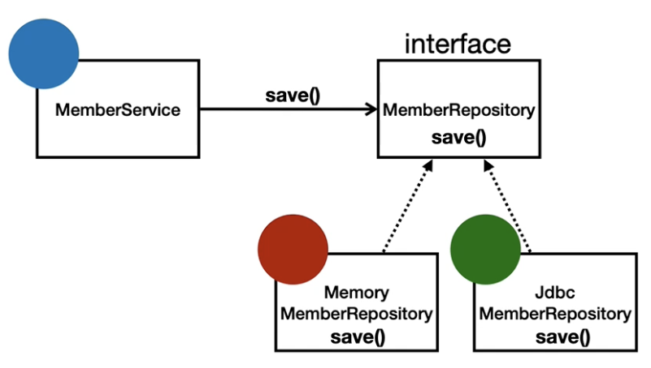

# 1. SOLID 5원칙

## 코드를 잘 관리하기 위해서

코드를 잘 관리하기 위해서는 심플하게 아래 2가지를 잘 해야 한다.

1. **분류** : 코드를 적절히 잘 분류
2. **교체** : 경우에 따라 특정 모듈을 교체

### 소프트웨어의 유지보수

소프트웨어는 **변경과 수정이 필수적**이다.
그래서 **유지보수성이 용이하도록** 코드를 구성해야 한다.

유지보수성을 고려하지 않고 코드를 수정하면 아래와 같은 사례들이 발생할 수 있다.

1. 기능이 복잡해 질수록 수정해야 할 부분을 파악하기 어렵다.
2. 수정한 부분이 아닌 부분에서 에러가 난다.

### 자바에서는?

Java (OOP) 에서는
_ Class 를 통해 코드를 체계적으로 분류를 할 수 있다.
_ Object 를 통해 특정 모듈을 교체할 수 있다.

## 역할과 구현 - 다형성

> 클라이언트는 변경하지 않고, 서버의 구현 기능을 유연하게 변경할 수 있다.

-   클라이언트
    -   ex. 운전자
-   역할
    -   `인터페이스`
    -   ex. 자동차
-   구현
    -   `클래스`
    -   ex. k3, 테슬라, 아반떼 ..

`자동차의 종류`가 변경돼도 `운전자`는 `자동차의 종류`는 신경쓰지 않아도 된다 -> 핵심은 `자동차 역할`이다.
`구현체`가 변경돼도 `클라이언트`는 `구현체의 종류`는 신경쓰지 않아도 된다 -> 핵심은 `인터페이스` 이다.



-   Member Service -> 클라이언트
-   Member Repository -> 역할 (인터페이스)
-   Memory Member Repository -> 구현체 1 (클래스)
-   Jdbc Member Repository -> 구현체 2 (클래스)

-> Member Service 는 Member Repository 에만 의존한다.

## SOLID 5원칙

OOP 에서 분류와 교체를 잘 하기 위해서는 **SOLID 5원칙**을 잘 지켜야 한다.

1. **SRP (Single Responsibility Principle) : 단일 책임 원칙**
    - 책임을 적절하게 나눠 코드의 변경시 `파급효과가 적도록` 한다.
    - 책임이 `너무 과하지도 적지도 않게` 하는 것이 중요하다.
2. **OCP (Open Closed Principle) : 개방 폐쇄 원칙**
    - `확장에는 열려`있고, `변경에는 닫혀`있다.
    - 아래 코드는 구현 객체를 변경하려면 클라이언트가 코드 변경이 필요 -> **OCP 위반**

```java
class MemberService {
	// private MemberRepository memberRepository = new MemoryMemberRepository();
	private MemberRepository memberRepository = new JDBCMemberRepository();
}
```

3.  **LSP (Liscov Substitution Principle) : 리스코프 치환 원칙**
    -             상속과 관련된 법칙으로 서브타입은 언제나 기반타입의 정확성을 깨지 않으면서, 기반타입의 인스턴스로 교체할 수 있어야 한다.
    -   Car 라는 인터페이스가 있다면, 하위 클래스들은 Car 여야 한다. (헬리콥터 X)
    -   `excel()` 은 앞으로 가야지, 뒤로 가면 안된다. (구현은 가능하지만 의미적으로)
    -   상속받은 클래스는 동일한 동작을 해야 재활용 가능성이 높아진다.
4.  **ISP (Interface Segregation Principle) : 인터페이스 분리 원칙**

    -   특정 클라이언트를 위한 인터페이스 여러 개가 범용 인터페이스 하나보다 낫다.
    -   역할을 분리시키면 역할이 더 명확해진다.
    -   인터페이스도 SRP 를 갖도록 설계해야 한다.
    -   자동차 인터페이스 -> 운전 인터페이스 + 정비 인터페이스
    -   `메서드 하나만 있는 인터페이스`를 만들어 사용해도 괜찮다.
    -   ISP 를 잘 따라야 구현이 편리하고, 재활용성이 올라간다.

5.  **DIP (Dependency Inversion Principle) : 의존관계 역전 원칙**
    -   구체화(구현 -> 클래스)에 의존하지 말고, 추상화(역할 -> 인터페이스)에 의존하라.
    -   아래 코드는 클라이언트가 구현 객체를 직접 선택 -> **DIP 위반**

```java
class MemberService {
	// private MemberRepository memberRepository = new MemoryMemberRepository();
	private MemberRepository memberRepository = new JDBCMemberRepository();
}
```

## 스프링이란

-   `DI 컨테이너 + IOC` 기술을 이용해 `다형성 + OCP, DIP` 를 가능하게 지원해준다. -> 클라이언트 코드 변경 없이 기능 확장 가능

**참고. 실무에서의 고민**

> 기본적으로 인터페이스의 도입은 비용이 든다. -> 코드 확인을 위해 한번 더 들어가야 된다.  
> 기능의 `확장 가능성`이 있다 -> **인터페이스 도입 O**  
> 기능의 `확장 가능성`이 없다 -> **인터페이스 도입 X**
